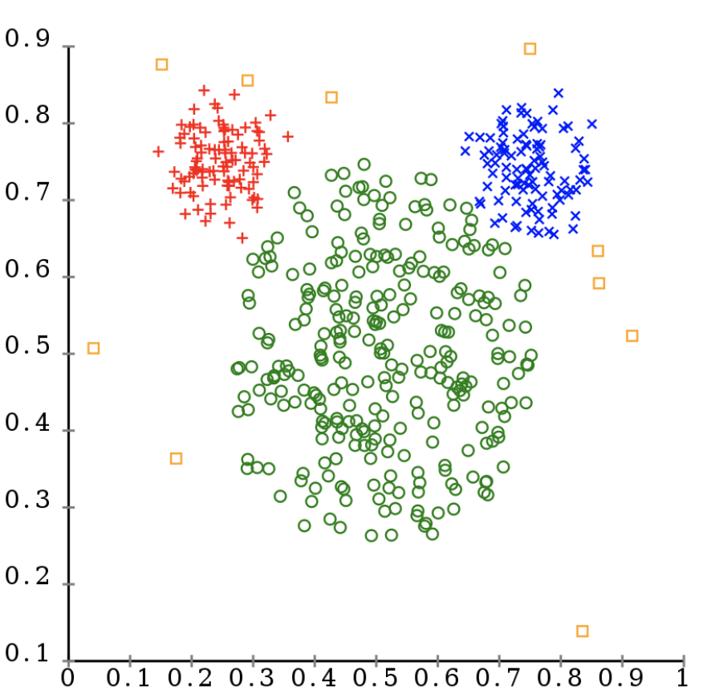
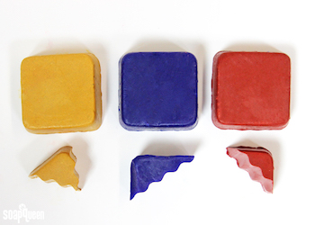
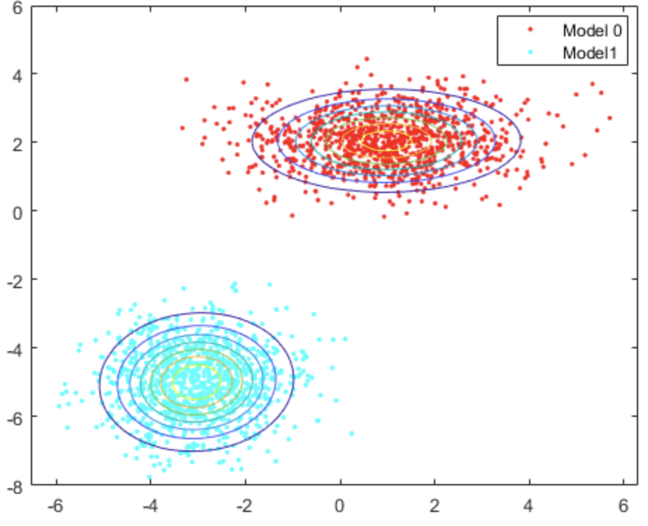
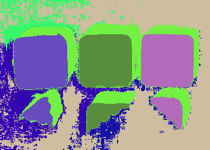

# Image Segmentation via K-means
Image segmentation is the process of partitioning a digital image into multiple segments (sets of pixels, also known as image objects). From the viewpoint of machine learning, image segmentation can be considered as pixel clustering problem. One of the most famous clustering algorithms in the world is k-means. In this tutorial, we are going to learn how to segment images via K-means.


## Naive K-means Clustering
Clustering is to group objects in such a way that objects in the same group (called a cluster) are more similar (in some sense) to each other than to those in other groups (clusters). Among various clustering methods, K-means is perhaps the most popular one.

<center>

</center>

The basic idea of K-means is to maintain a list of k cluster centers and updated them iteratively. Given cluster centers, each data point is assigned to the cluster whose center is closest to this point.

1. Random initialize K cluster centers. Denote them by $C_1, C_2, ..., C_K$. In practice, we usually randomly choose K data points as our initial centers.

2. Assign data points into clusters.<br/>
    For each data point $p$, find the closest clusters center $C_i$, then assign point $p$ to cluster $i$.
    $$\text{cluster of }p = \arg\min_i \text{Distance}(p, C_i)$$
    $$\text{cluster}_i = \{p| i = \arg\min_j \text{Distance}(p, C_j)\}$$
    Here, $\text{Distance}(\cdot, \cdot)$ is a distance metric. The most commonly used one is Euclidean distance.
    $$ \text{Distance}(p, q) = ||p-q||_2 = \sqrt{\sum_i (p_i-q_i)^2}

3. Update cluster centers. For each cluster, compute its new cluster center.
    $$C_i = \text{mean of cluster}_i = \frac{1}{|\text{cluster}_i|}\sum_{p\in \text{cluster}_i} p$$

4. Repeat step 2 and 3, until result converge, i.e., cluster centers and cluster assignment do not change any more. In assignment, this is simplified to choosing a large iteration number, instead of check whether it converges or not.

__Task__:
You need to complete `naive_k_means` function in `segment.py`

Implementation tips:

[`np.random.choice`](https://docs.scipy.org/doc//numpy-1.10.4/reference/generated/numpy.random.choice.html) could help you choose K data points as initial centers. This example random chooses 3 numbers from 0 to 9 without duplication.
```python
idx = np.random.choice(10, size=3, replace=False)
# array([9, 4, 6])
```

[`scipy.spatial.distance.cdist`](https://docs.scipy.org/doc/scipy/reference/generated/scipy.spatial.distance.cdist.html) could compute Euclidean distance between points.
```python
from scipy.spatial.distance import cdist
a = np.random.uniform(size=(5,2))
b = np.random.uniform(size=(4,2))
dist = cdist(a,b)
# dist.shape == (5,4)
# dist[i,j] == Euclidean distance between a[i] and b[j]
```

[`numpy.argmin`](https://numpy.org/doc/stable/reference/generated/numpy.argmin.html) could help you find the index of minimal values along certain dimension.
```python
x = np.array([[4,5,2],
              [1,0,3]])
np.argmin(x, axis=1) # array([2, 1])
np.argmin(x, axis=0) # array([1, 1, 0])
```

[`numpy.mean`](https://numpy.org/doc/stable/reference/generated/numpy.mean.html) could computes the arithmetic mean along a specified axis.
```python
x = np.array([[4,5,2],
              [1,0,3]])
np.mean(x, axis=1) # array([3.67, 1.33])
np.mean(x, axis=0) # array([2.5, 2.5, 2.5])
```


## Image Segmentation via Naive K-means
From the viewpoint of machine learning, image segmentation can be considered as pixel clustering problem. Given an image of shape $(H, W)$, we have $HW$ pixels in total. Our task is to group these pixels into several clusters.

Intuitively, if two pixels share similar pixel values, they should be in same cluster. In addition, position also matters. If two pixels are close to each other in image, they should tend to be in same cluster. So, we cluster pixels according to pixel values and pixel positions in this tutorial. Here is an example of how to segment `Color-Blocks.jpg` into 8 parts.

First we organize RGB values and positions of all pixels as an array `pixel_feature` of shape $(HW, 5)$. First 3 columns of `pixel_feature` are RGB values. The last 2 columns of `pixel_feature` are row indices and column indices respectively.
```python
img = read_img_as_array('Color-Blocks.jpg')
H, W, _ = img.shape

row, col = np.indices((H, W))
indices = np.stack([row, col], axis=2)
pixel_feature = np.concatenate([img, indices], axis=-1)
pixel_feature = pixel_feature.reshape((H * W, 5))
```
Then, we group pixels into 8 clusters.
```python
cluster_num, means = naive_k_means(pixel_feature, 8)
```
Finally, we draw clustering result as an image.
```python
cluster_num = cluster_num.reshape([H, W])
segment_visualization = draw_segment_result(cluster_num, colors=means[:, :3])
save_array_as_img(segment_visualization, 'naive_k_means.png')
```

<center>



</center>

From left to right: `Color-Blocks.jpg` and its segmentation result.

## Expectation Maximization (EM) Clustering
A major drawback of naive K-means is that it cannot tell cluster shape and size, but only cluster means. It implicitly assumes all clusters have same size and all clusters are of spherical shape. However, these assumptions are usually not true in reality. EM clustering overcomes this drawback. In addition to cluster means, EM clustering also estimates cluster variances. Bigger variance indicates bigger cluster size. Clusters may have different variances along different dimension, so elliptical shapes are allowed.

<center>

</center>

<!-- A property of naive K-means is that each point is assigned to either this cluster or that cluster without compromise during iteration. This kind of assignment is referred as __hard assignment__. Another way is soft assignment. Instead of assigning point to a single cluster, __soft assignment__ computes a list of probability of a point belonging to each cluster. E.g., $[0.1, 0.2, 0.7]$ means this point belongs to zeroth cluster with probability 0.1, first cluster with probability 0.2, and second cluster with probability 0.7. This kind of soft assignment leads to another clustering algorithm, __Expectation Maximization (EM) Clustering__. -->

<!-- <center>

</center> -->

Expectation Maximization (EM) usually assumes that whole dataset obeys Gaussian mixture model and each cluster obeys a Gaussian distribution. [`sklearn.mixture.GaussianMixture`](https://scikit-learn.org/stable/modules/generated/sklearn.mixture.GaussianMixture.html) could help us estimate means and variances of the Gaussian mixture model and tells us which cluster each pixel belongs to.

First, we create a `GaussianMixture` model, and set the number of components to the number of segments you want.
```python
from sklearn.mixture import GaussianMixture
gmm = GaussianMixture(n_components=8)
```

Then, fit the model to our pixel features.
```python
gmm.fit(pixel_feature)
```

Finally, get the cluster each pixel belongs to and also get cluster means.
```python
cluster_num = gmm.predict(pixel_feature)
means = gmm.means_
```

Draw segmentation result as an image:

<center>



EM Clustering
</center>

# Assignment
Task:
Partition `sun.jpg` into 10 segments via naive K-means and EM clustering:
1.  Naive K-means (8 points).
    - Complete functions `naive_k_means` in `segment.py`. You should implement all four steps of K-means described above by your own code. `sklearn.cluster.KMeans` is not allowed to use.
    - Apply naive K-means to `sun.jpg` and save the segmentation result to `naive_k_means.png`.
2. EM clustering (2 points).
    - Complete functions `em_clustering` in `segment.py`.
    - Apply EM clustering to `sun.jpg` and save the segmentation result to `em_clustering.png`.
3. Describe the difference between results of naive K-means and EM clustering, and discuss the reason behind it. Save your answer to the submitted PDF file. (2 points)

You may test your code on `Color-Blocks.jpg` to check whether you can get similar results as shown in this tutorial.

Your submission should contain:
1. A PDF file that consists of all the images you are asked to save and all the textual answers.
2. A runnable program `segment.py` that can reproduce your results.

Please submit before __23:59 on April 15th (Thursday)__. You may submit as many times as you want, but only your latest submission will be graded.
